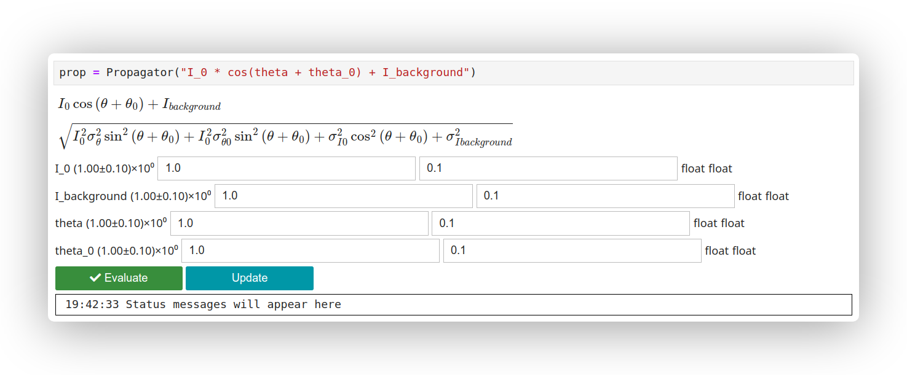

# ⚠️ This widget is still work in progress ⚠️


# Error propagation widget

*An ipynb widget for propagating and evaluating the uncertainty when evaluating a function.*


## Usages

First import the Propagator class from the propagator module.

```python
from propagator import Propagator
import numpy as np
```

### Basic usage

```python
prop = Propagator("I_0 * cos(theta + theta_0) + I_background")
```

Then use either the widget or the `set_variables` method to set the variables and their uncertainties.
Use the following methods to evaluate the function and the uncertainty at one or multiple points.

```python
y = prop.evaluate_function()
y_err = prop.evaluate_error_function()
```

### Usage with predefined variables

1. ```python
    from uncertainties import ufloat as uf

    x, a, b = sp.symbols("x a b")
    func = a * x + b

    prop = Propagator(func, {b: uf(20, 0), x: uf(10, 1)})
    ```

2. ```python
    prop = Propagator("I_0 * cos(theta + theta_0) + I_background")

    theta = np.linspace(0, 2 * np.pi, 100)
    theta_err = 0.01 * theta

    prop.set_variables({
        "I_0": (1.0, 0.1),
        "theta": (theta, theta_err),
        "theta_0": 0.0,
        "I_background": 0.0
    })
    ```
